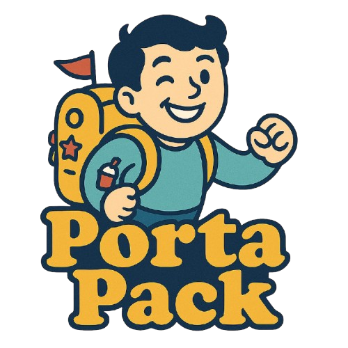

# 📦 PortaPack

<div align="center">
    
    
[](https://www.npmjs.com/package/portapack)
[](https://github.com/manicinc/portapack/actions)
[](https://coveralls.io/github/manicinc/portapack)
</div>

## 🌟 Introduction

**PortaPack** is a powerful, lightning-fast HTML bundling tool that transforms websites into compact, portable files. Pack entire web experiences into a single, self-contained HTML document with minimal effort.

## 📚 Documentation

- [📖 Getting Started](https://manicinc.github.io/portapack/getting-started)
- [⚙️ CLI Reference](https://manicinc.github.io/portapack/cli)
- [🛠 Configuration Guide](https://manicinc.github.io/portapack/configuration)
- [💻 API Reference](https://manicinc.github.io/portapack/api/)
- [🤝 Contributing Guidelines](https://manicinc.github.io/portapack/contributing)

## ✨ Killer Features

| Feature | Description |
|---------|-------------|
| 🧩 **Recursive Packing** | Bundle entire websites into a single, portable file |
| 🎯 **Total Asset Embedding** | Inline CSS, JS, images, and fonts seamlessly |
| 🧼 **Smart Minification** | Optimize HTML, CSS, and JS for minimal file size |
| 🌐 **Universal Compatibility** | Works flawlessly with local and remote sites |
| 🚀 **Blazing Fast** | Lightweight, efficient processing for quick results |

## 🚀 Quick Start

### Installation

```bash
# Global install
npm install -g portapack

# Project dependency
npm install --save-dev portapack
```

### Basic Usage

```bash
# Bundle a local HTML file
portapack ./index.html -o portable.html

# Crawl a remote website
portapack https://example.com --recursive -o site.html
```

## 💻 CLI Reference

### Command Syntax

```bash
portapack [options] [input]
```

### Core Options

| Option | Description |
|--------|-------------|
| `-o, --output <file>` | Output file path |
| `-m, --minify` | Enable all minification (HTML, CSS, JS) |
| `--no-minify` | Disable all minification |
| `-e, --embed-assets` | Embed assets as data URIs (default) |
| `--no-embed-assets` | Keep asset links relative/absolute |
| `-b, --base-url <url>` | Base URL for resolving relative links |
| `-d, --dry-run` | Run without writing output file |
| `-v, --verbose` | Enable verbose (debug) logging |

### Minification Options

| Option | Description |
|--------|-------------|
| `--no-minify-html` | Disable HTML minification |
| `--no-minify-css` | Disable CSS minification |
| `--no-minify-js` | Disable JavaScript minification |

### Recursive Crawling

| Option | Description |
|--------|-------------|
| `-r, --recursive [depth]` | Recursively crawl site (default depth: 1) |
| `--max-depth <n>` | Set maximum depth for recursive crawl |

### Logging

| Option | Description |
|--------|-------------|
| `--log-level <level>` | Set logging level: debug, info, warn, error, silent, none |

## 📋 CLI Examples

### Basic Examples

```bash
# Bundle a local HTML file with default settings
portapack ./index.html

# Bundle a remote page
portapack https://example.com -o example.html

# Bundle with verbose logging
portapack ./index.html -v
```

### Advanced Options

```bash
# Disable all minification
portapack ./index.html --no-minify

# Disable only CSS minification
portapack ./index.html --no-minify-css

# Customize base URL for asset resolution
portapack ./index.html --base-url https://cdn.example.com

# Keep external links instead of embedding assets
portapack ./index.html --no-embed-assets
```

### Recursive Website Bundling

```bash
# Recursively bundle a website (default depth: 1)
portapack https://example.com --recursive

# Set custom crawl depth (3 levels)
portapack https://example.com --recursive 3

# Alternative depth syntax
portapack https://example.com --max-depth 3

# Recursive bundle with all options
portapack https://example.com \
  --recursive 2 \
  --base-url https://example.com \
  --no-minify-js \
  --log-level debug \
  -o example-site.html
```

### Customized Workflow Examples

```bash
# Development workflow: no minification + verbose logs
portapack ./dev/index.html --no-minify -v -o ./dev/bundle.html

# Production workflow: full optimization
portapack ./src/index.html -o ./dist/index.html

# Test run without writing output
portapack ./index.html --dry-run -v

# Custom logging level
portapack ./index.html --log-level warn
```

## 🛠 Node.js API

PortaPack provides a flexible JavaScript/TypeScript API that can be used in your own projects.

### Main Functions

The library exports these primary functions:

| Function | Description |
|----------|-------------|
| `generatePortableHTML()` | Bundle a single HTML file or URL with its assets |
| `generateRecursivePortableHTML()` | Recursively crawl and bundle a website |
| `fetchAndPackWebPage()` | Fetch and pack a single web page |
| `bundleMultiPageHTML()` | Bundle multiple HTML pages into a single file |

### Basic API Usage

```typescript
import { generatePortableHTML } from 'portapack';

// Simple usage with local file
const result = await generatePortableHTML('./index.html');
console.log(`Generated HTML: ${result.html.length} bytes`);
console.log(`Build time: ${result.metadata.buildTimeMs}ms`);

// Simple usage with remote URL
const remoteResult = await generatePortableHTML('https://example.com');
```

### Advanced API Usage

```typescript
import { 
  generatePortableHTML, 
  generateRecursivePortableHTML,
  LogLevel
} from 'portapack';

// With full options
const result = await generatePortableHTML('./index.html', {
  embedAssets: true,      // Embed assets as data URIs
  minifyHtml: true,       // Minify HTML
  minifyCss: true,        // Minify CSS
  minifyJs: true,         // Minify JavaScript
  baseUrl: './src',       // Base URL for resolving assets
  logLevel: LogLevel.INFO // Set logging level
});

// Save the HTML to a file
import fs from 'fs';
fs.writeFileSync('output.html', result.html, 'utf-8');

// Access build metadata
console.log(`Build Stats:
  - Input: ${result.metadata.input}
  - Output Size: ${result.metadata.outputSize} bytes
  - Assets: ${result.metadata.assetCount}
  - Build Time: ${result.metadata.buildTimeMs}ms
`);
```

### Recursive Website Crawling

```typescript
import { generateRecursivePortableHTML } from 'portapack';

// Crawl a website with depth 2
const result = await generateRecursivePortableHTML(
  'https://example.com',
  2,
  { logLevel: LogLevel.DEBUG }
);

console.log(`Bundled ${result.metadata.pagesBundled} pages`);
```

### Multi-page Bundling

```typescript
import { bundleMultiPageHTML } from 'portapack';

// Define multiple pages to bundle
const pages = [
  { url: '/home', html: '<h1>Home</h1>' },
  { url: '/about', html: '<h1>About</h1>' },
  { url: '/contact', html: '<h1>Contact</h1>' }
];

// Bundle into a single HTML with client-side router
const html = bundleMultiPageHTML(pages);
```

## 🤝 Contribute & Support

[](https://github.com/sponsors/manicinc)
[](https://discord.gg/manicinc)

1. Fork the repo
2. Create a feature branch
3. Commit with `npm run commit`
4. Push & open a PR

## 📊 Project Health

<!-- | Aspect | Status |
|--------|--------|
| **Tests** | [](https://codecov.io/gh/manicinc/portapack) |
| **Code Quality** | [](https://codeclimate.com/github/manicinc/portapack) |
| **Dependencies** | [](https://libraries.io/github/manicinc/portapack) | -->

## 🌍 Connect

[](https://twitter.com/manicinc)
[](https://www.linkedin.com/company/manicinc)

## 📄 License

**MIT** — Built by [Manic Agency](https://manicagency.com)

<div align="center">
    <sub>Open Source Empowering Designers and Developers 🖥️</sub>
</div>