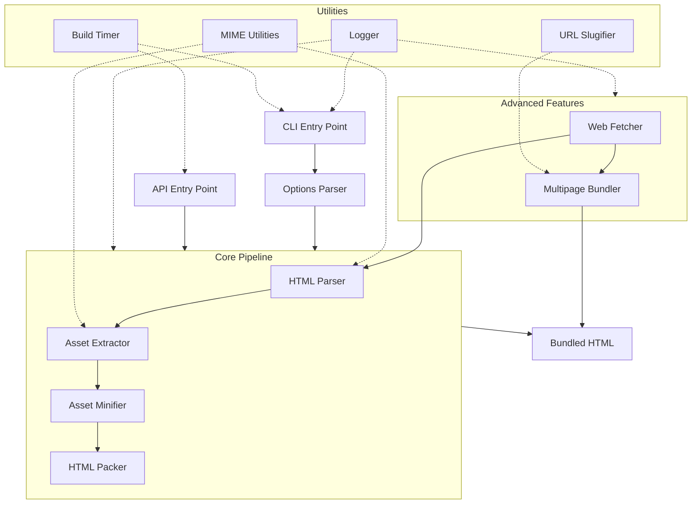

# PortaPack Architecture

## Overview

PortaPack is a sophisticated tool that bundles entire websites—HTML, CSS, JavaScript, images, and fonts—into self-contained HTML files for offline access. This document outlines the architectural components that make up the system.

## Entry Points

### CLI Interface

The command-line interface provides a convenient way to use PortaPack through terminal commands:

| Component | Purpose |
|-----------|---------|
| `cli-entry.ts` | Executable entry point with shebang support |
| `cli.ts` | Main runner that processes args and manages execution |
| `options.ts` | Parses command-line arguments and normalizes options |

### API Interface

The programmatic API enables developers to integrate PortaPack into their applications:

| Component | Purpose |
|-----------|---------|
| `index.ts` | Exports public functions like `pack()` with TypeScript types |
| `types.ts` | Defines shared interfaces and types for the entire system |

## Core Pipeline

The bundling process follows a clear four-stage pipeline:

### 1. HTML Parser (`parser.ts`)

The parser reads and analyzes the input HTML:
- Uses Cheerio for robust HTML parsing
- Identifies linked assets through element attributes (href, src, etc.)
- Creates an initial asset list with URLs and inferred types
- Handles both local file paths and remote URLs

### 2. Asset Extractor (`extractor.ts`)

The extractor resolves and fetches all referenced assets:
- Resolves relative URLs against the base context
- Fetches content for all discovered assets
- Recursively extracts nested assets from CSS (@import, url())
- Handles protocol-relative URLs and different origins
- Provides detailed logging of asset discovery

### 3. Asset Minifier (`minifier.ts`)

The minifier reduces the size of all content:
- Minifies HTML using html-minifier-terser
- Minifies CSS using clean-css
- Minifies JavaScript using terser
- Preserves original content if minification fails
- Configurable through command-line flags

### 4. HTML Packer (`packer.ts`)

The packer combines everything into a single file:
- Inlines CSS into `<style>` tags
- Embeds JavaScript into `<script>` tags
- Converts binary assets to data URIs
- Handles srcset attributes properly
- Ensures proper HTML structure with base tag

## Advanced Features

### Web Fetcher (`web-fetcher.ts`)

For remote content, the web fetcher provides crawling capabilities:
- Uses Puppeteer for fully-rendered page capture
- Crawls websites recursively to specified depth
- Respects same-origin policy by default
- Manages browser instances efficiently
- Provides detailed logging of the crawl process

### Multipage Bundler (`bundler.ts`)

For bundling multiple pages into a single file:
- Combines multiple HTML documents into one
- Creates a client-side router for navigation
- Generates a navigation interface
- Uses slugs for routing between pages
- Handles page templates and content swapping

## Utilities

### Logger (`logger.ts`)
- Customizable log levels (debug, info, warn, error)
- Consistent logging format across the codebase
- Optional timestamps and colored output

### MIME Utilities (`mime.ts`)
- Maps file extensions to correct MIME types
- Categorizes assets by type (CSS, JS, image, font)
- Provides fallbacks for unknown extensions

### Build Timer (`meta.ts`)
- Tracks build performance metrics
- Records asset counts and page counts
- Captures output size and build duration
- Collects errors and warnings for reporting

### URL Slugifier (`slugify.ts`)
- Converts URLs to safe HTML IDs
- Handles special characters and normalization
- Prevents slug collisions in multipage bundles

## Asynchronous Processing

PortaPack uses modern async patterns throughout:

- **Promise-based Pipeline**: Each stage returns promises that are awaited
- **Sequential Processing**: Assets are processed in order to avoid overwhelming resources
- **Error Boundaries**: Individual asset failures don't break the entire pipeline
- **Resource Management**: Browser instances and file handles are properly closed

## Build System

PortaPack uses a dual build configuration:

| Build Target | Format | Purpose |
|--------------|--------|---------|
| CLI | CommonJS (.cjs) | Works with Node.js and npx |
| API | ESModule (.js) | Modern import/export support |

TypeScript declarations (.d.ts) are generated for API consumers, and source maps support debugging.

## Current Limitations

### Script Execution Issues

- Inlined scripts with `async`/`defer` attributes lose their intended loading behavior
- ES Modules with import/export statements may fail after bundling
- Script execution order can change, breaking dependencies

### Content Limitations

- CORS policies may prevent access to some cross-origin resources
- Only initially rendered content from SPAs is captured by default
- Very large sites produce impractically large HTML files

### Technical Constraints

- No streaming API or WebSocket support
- Service worker capabilities are not preserved
- Memory pressure with large sites
- Limited support for authenticated content